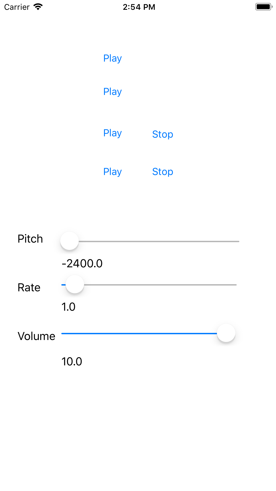

# AVAudioEngine Demo
This demo shows how to work work with multiple Audio File playing with AVAudioEngine. One can click on different play buttons, can change the volumn of the AVAudioPlayerNode and can change Pitch or Rate of the third audio file. UI of the screen is as below:

